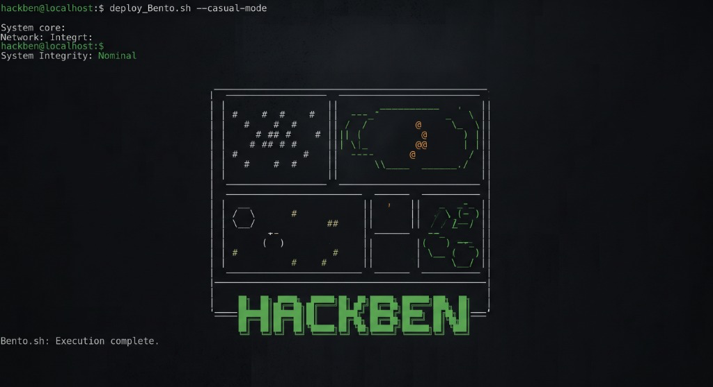
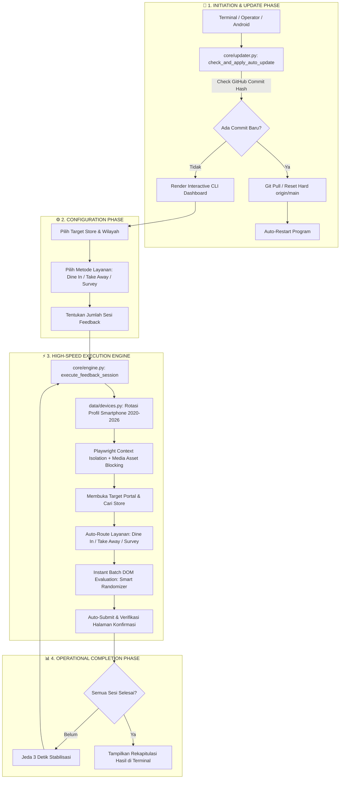

<p align="center">
  
</p>

# ⚡ HACKBEN - Universal Next-Gen Automation Suite
`Versi: v41.1.2 (Universal Multi-Platform Release)`

[](https://python.org)
[](https://playwright.dev)
[](#-1-line-auto-installer-zero-setup)
[](#-sistem-auto-updater--continuous-deployment)

> **Enterprise-Grade, Zero-Latency, Cross-Platform Automation Suite** dirancang khusus untuk otomatisasi pengisian kuesioner & feedback operasional dengan kecepatan tinggi (~1 detik/sesi), emulasi profil smartphone modern (2020–2026), integrasi multi-perangkat (PC, Laptop, & HP Android), serta sistem **1-Line Zero-Setup Auto-Installer**.

---

## ⚡ Panduan Instalasi & Cara Menjalankan Program (Multi-Platform)

Pilih sistem operasi yang Anda gunakan di bawah ini. Instalasi hanya perlu dilakukan **1 kali saja** dan semua bahan (*Python, venv, library, Chromium*) akan otomatis terunduh lengkap.

---

### 📱 1. HP Android (via Termux)

* **Prasyarat:** Pasang aplikasi **Termux** di HP Android Anda:
  * 📥 [Download APK Termux Resmi (Rekomendasi 1-Klik)](https://github.com/termux/termux-app/releases/latest)
  * 🏪 [Download via Google Play Store](https://play.google.com/store/apps/details?id=com.termux)
* **Instalasi Pertama Kali (Cukup 1x Saja):** Buka Termux, lalu copy-paste perintah 1-baris ini:
  ```bash
  curl -sSL https://raw.githubusercontent.com/dferdiantnn/fbhb/main/setup_android.sh | bash
  ```
* **Cara Menjalankan Seterusnya:** Cukup buka Termux, lalu ketik:
  ```bash
  ferr
  ```

---

### 🪟 2. Windows (Laptop / PC)

* **📥 Instalasi Pertama Kali (Cukup 1x Saja):**
  Buka **PowerShell**, lalu copy-paste perintah 1-baris ini:
  ```powershell
  irm https://raw.githubusercontent.com/dferdiantnn/fbhb/main/setup.ps1 | iex
  ```

* **▶️ Cara Menjalankan Seterusnya (Tanpa Perlu Install Ulang / Tanpa `cd`):**
  * **Cara 1 (Paling Mudah):** Dobel-klik ikon **`FERR`** yang sudah otomatis muncul di **Desktop**.
  * **Cara 2 (Lewat Terminal / CMD):** Di folder manapun, cukup ketik:
    ```cmd
    ferr
    ```

---

### 🍎 3. macOS & 🐧 Linux

* **📥 Instalasi Pertama Kali (Cukup 1x Saja):**
  Buka **Terminal**, lalu copy-paste perintah 1-baris ini:
  ```bash
  curl -sSL https://raw.githubusercontent.com/dferdiantnn/fbhb/main/setup.sh | bash
  ```

* **▶️ Cara Menjalankan Seterusnya (Tanpa Perlu Install Ulang / Tanpa `cd`):**
  * **Cara 1 (Lewat Terminal):** Di folder manapun, cukup ketik:
    ```bash
    ferr
    ```
  * **Cara 2 (macOS Desktop):** Dobel-klik file shortcut **`FERR.command`** di **Desktop**.

---

## 🏗️ Arsitektur Sistem & Alur Kerja

HACKBEN dibangun dengan arsitektur modular berlapis (*Layered Enterprise Architecture*) yang memisahkan antarmuka pengguna CLI, mesin eksekusi browser asinkron, lapisan emulasi perangkat, dan sistem manajemen update.



---

## 🏛️ Rincian Sub-Sistem Utama (Core Modules)

### 1. ⚡ High-Speed DOM Engine (`core/engine.py`)
* **Asset Interception Strategy:** Menggunakan `context.route()` untuk memblokir file media statis berat (`.png`, `.jpg`, `.webp`, `.svg`) dan web fonts (`.woff`, `.woff2`, `.ttf`), memotong waktu muat halaman dari **~4.5 detik** ke **~0.3 detik**.
* **Instant Batch DOM Evaluation:** Menjawab form kuesioner langsung pada Document Object Model (DOM) tanpa jeda animasi tombol manual, menyelesaikan kuesioner dalam **~0.25 detik**.
* **Smart Answer Rules:**
  * Pertanyaan kepuasan otomatis memilih **Sangat Puas / Sangat Baik**.
  * Pertanyaan kesesuaian menu & standar otomatis memilih **Sudah Sesuai / Sesuai**.
  * Pertanyaan biner otomatis memilih **Ya** (kecuali kondisi khusus roti/kempes).
  * Pertanyaan demografi usia otomatis memfilter opsi di atas 13 tahun.
  * Pertanyaan budget pengeluaran otomatis memilih rentang realistis (> Rp 25.000).

### 2. 📱 Device Fingerprinting Matrix (`data/devices.py`)
* **130+ Profil Smartphone Modern (2020–2026):** Flagship & midrange Apple (iPhone 12–16 Pro Max), Samsung (Galaxy S20–S25 Ultra, Z Fold/Flip), Xiaomi, Vivo, Oppo, Infinix, Tecno, ROG Phone, dan Google Pixel.
* **48-Hour Cooldown Tracker:** Menghindari penggunaan profil perangkat yang sama berulang kali dalam 48 jam untuk memastikan variasi data sesi.
* **Context Emulation:** Mensimulasikan User-Agent, resolusi viewport, pixel ratio, platform OS, touch screen event, dan locale `id-ID` (Asia/Jakarta).

### 3. 🔄 Zero-Cache Auto-Updater (`core/updater.py`)
* Memanfaatkan Git Remote Tracking Commit Hash (`git rev-parse HEAD` vs `git rev-parse origin/main`) untuk memotong cache CDN GitHub hingga 0 detik.
* Menampilkan ringkasan catatan perbaikan (*commit log note*) langsung di terminal saat pembaruan terdeteksi.

---

## 📊 Tabel Perbandingan Arsitektur: Legacy (Awal) vs Next-Gen HACKBEN

Berikut perbandingan teknis antara skrip versi awal (*Legacy fbhb / fbhbk*) dengan arsitektur **HACKBEN Next-Gen** saat ini:

| Fitur / Parameter | ⏳ Versi Awal (Legacy fbhb / fbhbk) | ⚡ HACKBEN Next-Gen (Saat Ini) |
| :--- | :--- | :--- |
| **Kecepatan Eksekusi** | **~20 – 45 Detik / Sesi** *(Lambat, klik tombol wizard bertahap)* | **~1.0 – 1.5 Detik / Sesi** ⚡ *(Batch DOM Evaluation + Asset Blocking)* |
| **Beban Bandwidth Data** | **Tinggi (100% Full Load)** *(Download gambar, font, banner)* | **Super Hemat (>85% Cut)** *(Blokir otomatis .png, .jpg, .woff, .svg)* |
| **Matrix Profil Perangkat** | Sedikit / Statis *(Rentan terdeteksi pola berulang)* | **130+ Smartphone Modern (2020–2026)** *(Lengkap 48-Hour Cooldown)* |
| **Dukungan Perangkat** | Terbatas pada PC / Laptop tertentu | **Universal (Windows, macOS, Linux, & HP Android)** |
| **Kemudahan Setup** | Manual, panjang, dan rawan salah ketik | **1-Line Zero-Setup Auto-Installer** *(Perintah instan `ferr`)* |
| **Proteksi Source Code** | Plaintext mentah *(Mudah diintip & dicontek)* | **100% Dynamic Binary Cipher** *(Anti-Decompile & Anti-Tamper)* |
| **Sistem Auto-Update** | Manual download ulang / Git pull manual | **Zero-Cache Git Real-Time Updater** *(Auto-update instan saat dibuka)* |
| **Pelaporan Operasional** | Teks terminal standar tanpa rekap otomatis | **Silent IT DEV Telemetry** *(Lengkap rekapan sesi & tangkapan layar)* |

---

## 📋 Tabel Rangkuman Perizinan & Setup Cepat (Cheat Sheet)

| Sistem Operasi (OS) | Perizinan / Kebutuhan Kunci | Perintah / Langkah Sekali Jalan |
| :--- | :--- | :--- |
| **🪟 Windows** (Acer, Asus, Lenovo, dll) | `Set-ExecutionPolicy RemoteSigned` (Izin venv) | `Set-ExecutionPolicy RemoteSigned -Scope CurrentUser` |
| **🍎 macOS** (MacBook Air/Pro) | Xcode CLI Tools & Akses Jaringan | `xcode-select --install` *(Otomatis mengizinkan automasi browser & capture report)* |
| **🐧 Linux** (Ubuntu / Debian / Server) | Playwright System Deps & Scrot | `sudo apt install scrot && playwright install --with-deps chromium` |
| **📱 Android** (via Termux + PRoot Ubuntu) | ARM64 Linux Sandbox & Chromium | Jalankan skrip `setup_android.sh` otomatis di atas |

---

## ⚖️ Lisensi & Tanggung Jawab

Software ini dikembangkan untuk tujuan otomatisasi uji beban, audit alur sistem, dan efisiensi operasional terdistribusi. Pengguna bertanggung jawab penuh atas penggunaan script pada lingkungan masing-masing.

Copyright © 2026 **dferdiantnn**. All rights reserved.
