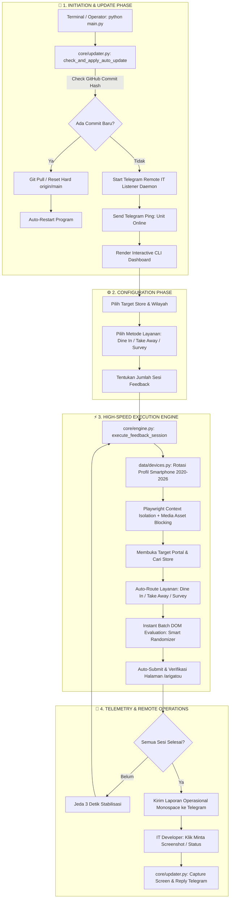

# ⚡ HACKBEN - Universal Next-Gen Automation Suite
`Versi: v11.0.7 (Enterprise Release)`

[](https://python.org)
[](https://playwright.dev)
[](#-arsitektur-sistem--alur-kerja)
[](#-telemetry--remote-it-daemon)
[](#-sistem-auto-updater--continuous-deployment)

> **Enterprise-Grade, Zero-Latency, Cross-Platform Automation Suite** dirancang khusus untuk otomasi pengisian kuesioner & feedback operasional dengan kecepatan tinggi, emulasi profil perangkat modern (2020–2026), integrasi jaringan fleksibel, serta telemetri *real-time* dan *remote monitoring* tanpa dependensi eksternal.

---

## 🏗️ Arsitektur Sistem & Alur Kerja

HACKBEN dibangun dengan pendekatan **Modular Layered Architecture** yang memisahkan antara antarmuka pengguna, mesin eksekusi browser, lapisan emulasi perangkat, sistem jaringan, dan bridge telemetri remote.

### 📊 Diagram Alur Kerja End-to-End



---

## 🏛️ Rincian Sub-Sistem Utama (Core Modules)

### 1. ⚡ High-Speed DOM Engine (`core/engine.py`)
* **Asset Interception Strategy:** Menggunakan `context.route()` untuk memblokir unduhan file statis berat seperti gambar (`.png`, `.jpg`, `.webp`, `.svg`) dan web fonts (`.woff`, `.woff2`, `.ttf`). Waktu buka halaman portal turun drastis dari **~4.5 detik** menjadi **~0.3 detik**.
* **Instant Batch DOM Evaluation:** Menjawab seluruh kuesioner multi-step form langsung di level Document Object Model (DOM) dalam satu putaran tanpa jeda animasi tombol manual, menyelesaikan kuesioner dalam **~0.25 detik**.
* **Smart Answer Rules:**
  * Pertanyaan kepuasan otomatis memilih **Sangat Puas / Sangat Baik**.
  * Pertanyaan kesesuaian menu & standar otomatis memilih **Sudah Sesuai / Sesuai**.
  * Pertanyaan biner otomatis memilih **Ya** (kecuali kondisi khusus roti/kempes).
  * Pertanyaan demografi usia otomatis memfilter opsi di atas 13 tahun.
  * Pertanyaan budget pengeluaran otomatis memilih rentang realistis (> Rp 25.000).

### 2. 📱 Device Fingerprinting Matrix (`data/devices.py`)
* **130+ Profil Smartphone Modern (2020–2026):** Mencakup lini flagship dan midrange dari Apple (iPhone 12–16 Pro Max), Samsung (Galaxy S20–S25 Ultra, Z Fold/Flip), Xiaomi, Vivo, Oppo, Infinix, Tecno, ROG Phone, dan Google Pixel.
* **48-Hour Cooldown Tracker:** Mencegah penggunaan profil perangkat yang sama berulang kali dalam kurun waktu 48 jam untuk menjaga keunikan data sesi.
* **Context Emulation:** Mensimulasikan User-Agent, resolusi viewport, pixel ratio, platform OS, touch screen event, dan locale `id-ID` (Asia/Jakarta).

### 3. 📡 Telemetry & Remote IT Daemon (`core/updater.py`)
* **Zero-Dependency Architecture:** Seluruh modul telemetri dibangun menggunakan standar *built-in* Python (`urllib.request` + `json`) tanpa ketergantungan library luar (`requests`, dll), menjamin **100% reliabilitas** di laptop apa pun.
* **Hardware & Host Identification:** Otomatis mendeteksi nama hostname operator, merk pabrikan BIOS/WMI (seperti **Acer**, **ASUS**, **Lenovo**, **HP**), arsitektur chip, dan model spesifik perangkat (contoh: `USER-02 - Acer Aspire Z4-471 (Windows)` atau `fox.local - MacBook Air (Apple M1)`).
* **Remote IT Control:** IT Developer dapat memantau armada laptop dari Telegram secara langsung:
  * Tombol **`[ 📸 Minta Screenshot Layar ]`** untuk mengambil tangkapan layar monitor laptop operator secara *real-time*.
  * Tombol **`[ 🔄 Cek Status Unit ]`** atau perintah `/status`, `/test`, `/ping` untuk memastikan unit online.

### 4. 🔄 Zero-Cache Auto-Updater
* Memanfaatkan Git Remote Tracking Commit Hash (`git rev-parse HEAD` vs `git rev-parse origin/main`) untuk memotong cache CDN GitHub hingga 0 detik.
* Menampilkan ringkasan catatan perbaikan (*commit log note*) langsung di terminal saat pembaruan terdeteksi.

---

## 🔒 Panduan Proteksi & Obfuscation Source Code

Untuk menjaga kerahasiaan logika bisnis, token bot, dan arsitektur script dari inspeksi pihak ketiga maupun operator lapangan, gunakan salah satu metode proteksi berikut:

### Metode 1: AST Code Obfuscation (PyArmor)
Mengenkripsi struktur Abstract Syntax Tree (AST), mengacak nama variabel/fungsi, dan menambahkan runtime key decryption:

```bash
# 1. Install PyArmor
pip install pyarmor

# 2. Obfuscate seluruh project ke folder dist/
pyarmor gen -O dist_protected -r main.py core/ data/

# 3. Jalankan versi terproteksi
cd dist_protected && python main.py
```
*Hasil:* Seluruh file `.py` berubah menjadi deretan binary terenkripsi yang tidak dapat dibaca oleh decompiler atau text editor.

### Metode 2: Kompilasi ke Native Standalone Binary (.EXE / Mach-O)
Mengompilasi seluruh source code Python menjadi file binary mesin mandiri (Standalone Executable):

* **Di Windows (Menghasilkan HACKBEN.exe):**
  ```cmd
  pip install pyinstaller
  pyinstaller --onefile --noconsole --name "HACKBEN" main.py
  ```
* **Kompilasi C via Cython / Nuitka (Performa Ekstrem C-Speed):**
  ```bash
  pip install nuitka
  python -m nuitka --standalone --onefile --plugin-enable=playwright main.py
  ```

---

## 💻 Panduan Instalasi & Penggunaan Cepat

### 1. Clone Repository
```bash
git clone https://github.com/dferdiantnn/fbhb.git
cd fbhb
```

### 2. Konfigurasi Virtual Environment & Dependensi
* **macOS / Linux:**
  ```bash
  python3 -m venv venv
  source venv/bin/activate
  pip install -r requirements.txt
  playwright install chromium
  ```
* **Windows (Command Prompt / PowerShell):**
  ```cmd
  python -m venv venv
  venv\Scripts\activate
  pip install -r requirements.txt
  playwright install chromium
  ```

### 3. Menjalankan Dashboard
```bash
python main.py
```

---

## 📊 Format Laporan Operasional Telegram

Setiap kali sesi kuesioner selesai atau unit dinyalakan, bot secara otomatis mengirimkan log berformat monospace simetris ke channel/chat Telegram IT:

```text
📊 LOG OPERASIONAL HACKBEN
Perangkat : USER-02 - Acer Aspire Z4-471 (Windows)
Store     : HOKBEN TRANSMART CEMPAKA PUTIH
Layanan   : TAKE AWAY
Status    : Selesai (10/10 Berhasil)
Waktu     : 2026-08-21 14:30:00

[ 📸 Minta Screenshot Layar ]   [ 🔄 Cek Status Unit Ini ]
```

---

## ⚖️ Lisensi & Tanggung Jawab

Software ini dikembangkan untuk tujuan otomatisasi uji beban, audit alur sistem, dan efisiensi operasional terdistribusi. Pengguna bertanggung jawab penuh atas penggunaan script pada lingkungan masing-masing.

Copyright © 2026 **dferdiantnn**. All rights reserved.
